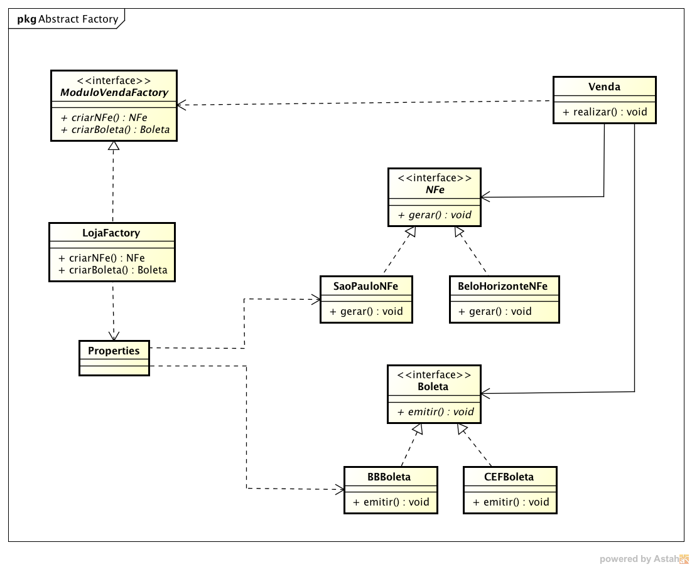

# Desafio venda-produto
Você foi contratado para criar um framework que auxiliará comerciantes a fazerem vendas dos seus produtos.

Todo o processo de venda é o mesmo:

* Gerar uma nota fiscal eletrônica que irá calcular o valor do imposto dos produtos.
* Emitir um boleto bancário com a descrição dos produtos e o valor do imposto discriminado.

Para facilitar um pouco sua vida, não precisa de realmente gerar uma nota fiscal eletrônica de verdade e nem gerar um boleto, apenas a simulação é importante, pois nosso objetivo é o padrão Abstract Factory.

O cálculo do imposto ficará na Nota Fiscal Eletrônica (NF-e), mas existe um detalhe importante. Cada estado brasileiro têm suas regras para cálculo do imposto, então seu sistema deve ser capaz de realizar uma venda independênte do estado que ele estiver.

A boleta também tem suas particularidade, um comerciante pode escolher utilizar a Caixa Economica Federal ou outro banco, como o Banco do Brasil.

Então sua tarefa é criar um framework estensível que possa realizar uma venda cujo procedimento foi descrito, porém trocando a família de objetos que essa venda é composta.

Para as coisas ficarem mais interessante, e seu sistema ficar muito configurável, você irá deixar a escolha das implementações em um arquivo .properties.

O que isso quer dizer? Que você terá apenas uma implementação de fábrica abstrata. E as implementações de cada objeto (NFe ou Boleta) será feita utilizando a API de Reflection.

Veja abaixo o arquivo .properties sugerido:

```shell
nfe=com.algaworks.nfe.sp.SaoPauloNFe
boleta=com.algaworks.boleta.bb.BBBoleta
```
Repare que a chave "nfe" tem o nome da classe que sabe como gerar NF-e para São Paulo. Já a chave "boleta" tem o nome da classe que gera a boleta para o Banco do Brasil.

Se você chamar esse arquivo de config.properties e colocá-lo na pasta: `src/main/resources` no seu projeto Maven, para carregá-lo as propriedades, utilize o código abaixo:

```java
Properties prop = new Properties();
prop.load(this.getClass().getResourceAsStream("/config.properties"));
```

Agora sempre que você precisar recuperar o valor de uma chave, basta executar o código:

```java
String classeNFe = this.prop.getProperty("nfe");
```

Para criar uma instância de uma classe com um nome, ou seja, uma String, basta utilizarmos generics da seguinte forma:

```java
String classeNFe = this.prop.getProperty("nfe");
NFe nfe = (NFe) Class.forName(this.prop.getProperty("nfe")).newInstance();
```

## Diagrama
